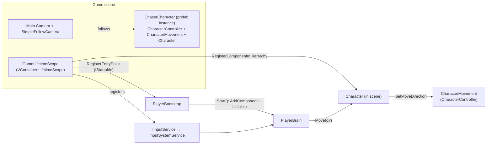

# Foundation Implementation — DI + Character Body + Player Movement

- **Date:** 2026-09-18
- **Status:** Implemented & verified in Unity (EditMode 10/10; Play mode: 1 PlayerBrain, 0 errors)
- **Branch:** `feature/foundation-di-character-body`
- **Spec:** [chase-game core design](../superpowers/specs/2026-09-09-chase-game-core-design.md) — Chapter A §2–6, Chapter B B0/B1/B6/B8
- **Plan:** [foundation plan](../superpowers/plans/2026-09-18-foundation-di-character-body.md)

## 1. What this slice delivers

The first runnable vertical slice of the chase game: **one character in the `Game` scene, driven by keyboard input**, built on the spec's **Body / Brain separation** wired with **VContainer** DI.

Intentionally **out of scope** (later slices): abilities/Gun, AI/Behaviour Tree, spawning/TeamRoster, capture/jail/rescue, match & win-lose, HUD/UI, animation. This slice only proves the architecture end-to-end.

## 2. Architecture

A character = **Body** (executes) + **Brain** (decides). The Brain issues commands; the Body executes and never knows who drives it. The Brain is attached at runtime ("Method A"), so the prefab stays a pure Body.

**Runtime flow:** `GameLifetimeScope.Awake` builds the container → the `PlayerBootstrap` entry point runs → it adds a `PlayerBrain` to the scene `Character` and initializes it with the injected `IInputService` → each frame `PlayerBrain.Tick` reads `MoveAxis`, maps it to a world direction, and calls `Character.Move`, which forwards to `CharacterMovement` (unless the character is `Jailed`).

## 3. Assemblies

| Assembly (asmdef) | Path | References |
|---|---|---|
| `ChaseGame` | `Assets/Scripts/ChaseGame.asmdef` | `VContainer`, `Unity.InputSystem`, `DOTween.Modules` |
| `ChaseGame.Tests.EditMode` | `Assets/Tests/EditMode/ChaseGame.Tests.EditMode.asmdef` | `ChaseGame`, TestRunner, `nunit.framework.dll` |

> **Note:** `ChaseGame.asmdef` sits at `Assets/Scripts`, so it also compiles the pre-existing `LoadingBar.cs`. Because that file uses DOTween's `DOFillAmount` (a `DOTween.Modules` extension), the assembly references `DOTween.Modules`. All game sub-namespaces (`Characters`, `Input`, `Brains`, `Infrastructure`) live in this single assembly — they are namespaces, not separate assemblies.

## 4. Code map

### Characters (`Assets/Scripts/Characters/`)
| File | Responsibility | Key API |
|---|---|---|
| `Team.cs` | Team enum | `Team { Chaser, Runner }` |
| `CaptureState.cs` | Runner state enum | `CaptureState { Free, Jailed }` |
| `CharacterStats.cs` | Tunables (SO) | `float MoveSpeed` (serialized `moveSpeed`, default 5) |
| `ICharacterMovement.cs` | Movement command seam | `void SetMoveDirection(Vector3)` |
| `CharacterMovement.cs` | Real movement | `static Vector3 ComputeVelocity(Vector3 dir, float speed)`; `Update` applies velocity + gravity via `CharacterController` |
| `Character.cs` | Body root / command API | `Team`, `CaptureState`, `void Move(Vector3)` (no-op when `Jailed`), `SetMovementForTests(ICharacterMovement)` |

### Input (`Assets/Scripts/Input/`)
| File | Responsibility | Key API |
|---|---|---|
| `IInputService.cs` | Input seam | `Vector2 MoveAxis` |
| `InputSystemService.cs` | Concrete input | reads `Keyboard.current` (WASD/arrows) + `Gamepad.current` left stick, clamped to unit length |

### Brains (`Assets/Scripts/Brains/`)
| File | Responsibility | Key API |
|---|---|---|
| `CharacterBrain.cs` | Brain base | `protected Character Character`; `void Initialize(Character)` |
| `PlayerBrain.cs` | Player brain | `void Initialize(Character, IInputService)`; `static Vector3 ToWorldMove(Vector2)` → `(x,0,y)`; `void Tick()`; `Update()` calls `Tick()` |

### Infrastructure (`Assets/Scripts/Infrastructure/`)
| File | Responsibility | Key API |
|---|---|---|
| `GameLifetimeScope.cs` | Per-scene DI scope | registers `IInputService`→`InputSystemService` (Singleton), `RegisterComponentInHierarchy<Character>()`, `RegisterEntryPoint<PlayerBootstrap>()` |
| `PlayerBootstrap.cs` | Runtime brain attach (`IStartable`) | `Start()` → `AddComponent<PlayerBrain>()` + `Initialize(character, input)` |
| `SimpleFollowCamera.cs` | Camera follow | `LateUpdate` SmoothDamp toward `target + offset`, then `LookAt(target)` |

> `PlayerBootstrap` is a temporary foundation harness that wires the single scene `Character`. It will be replaced by `SpawnManager` once the spawning slice lands.

## 5. Unity assets & scene wiring

| Asset / object | Where | Setup |
|---|---|---|
| `ChaserStats` | `Assets/Configs/ChaserStats.asset` | `CharacterStats`, Move Speed = 5 |
| `ChaserCharacter` | `Assets/Prefabs/ChaserCharacter.prefab` | Pure Body: `CharacterController` (h 1, r 0.35, center y 0.5) + `CharacterMovement` (Stats = ChaserStats) + `Character` (Team = Chaser). Child `Visual` = `Assets/Models/Player/Rig_Chick_Prop.fbx`. No Brain. |
| Scene `Game` | `Assets/Scenes/Game.unity` | `ChaserCharacter` instance at (0,1,0); `GameLifetimeScope` object; `Main Camera` has `SimpleFollowCamera` (Target = ChaserCharacter) |

**Project setting:** Player ▸ Active Input Handling = *Input System Package* (or *Both*).

**Packages** (`Packages/manifest.json`): VContainer via Git URL `#1.18.0`; MCP-for-Unity bridge (`com.coplaydev.unity-mcp`) for editor automation.

## 6. Testing

EditMode tests in `Assets/Tests/EditMode/` (10 tests, all passing):

| Test file | Covers |
|---|---|
| `HarnessSmokeTests.cs` | test harness runs |
| `CharacterMovementMathTests.cs` | `ComputeVelocity`: zero stays zero, normalize+scale, diagonal magnitude |
| `CharacterCommandGatingTests.cs` | `Character.Move` forwards when Free, no-ops when Jailed; `CaptureState` defaults Free (uses `SpyCharacterMovement`) |
| `PlayerBrainTests.cs` | `ToWorldMove` axis mapping; `Tick` forwards input; no move when Jailed (uses `FakeInputService`) |

Run: Unity Test Runner ▸ EditMode ▸ Run All. Runtime wiring (DI resolve, single `PlayerBrain` attached) is verified by entering Play mode — it is not an automated PlayMode test in this slice.

## 7. How to extend

- **New role / character:** duplicate the prefab pattern (pure Body: `CharacterController` + `CharacterMovement` + `Character` with the role's `Team` and `CharacterStats`), no Brain.
- **New brain (e.g. AI):** subclass `CharacterBrain`, attach at spawn like `PlayerBootstrap` does. The Body API is unchanged.
- **Swap movement backend:** implement `ICharacterMovement` differently (e.g. NavMeshAgent for AI); `Character` depends only on the interface.
- **Swap/test input:** implement `IInputService`; only `PlayerBrain` consumes it.

## 8. Known follow-ups (deferred by design)

- **Jailed immobilization:** `Character.Move` no-ops when Jailed, but `CharacterMovement` keeps re-applying the last direction, so a character jailed while moving would slide. Zero the movement on jail entry in the **capture/jail** slice. (Latent now — nothing sets `Jailed` at runtime yet.)
- **Animation:** the chicken model has an Animator + walk/idle clips, not yet driven by movement speed. Wire in a later slice.
- **Gravity:** `CharacterMovement.Update` adds `Physics.gravity` as a velocity (adequate for flat ground); revisit for slopes/jumps.
- **Spawn position:** the character sits at (0,1,0); reposition to an open spot on the map as needed.
