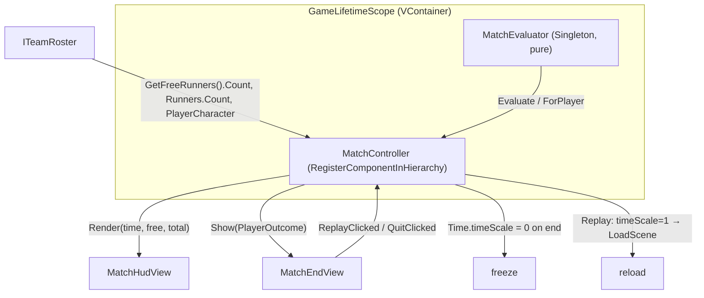

# Match End + UI — Win/Lose Conditions, HUD, End Screen

- **Date:** 2026-09-23
- **Status:** Implemented & verified in Unity (EditMode 94/94; real-scene playtest across 3 matches — BẠN THẮNG + BẠN THUA both correct, freeze + Chơi lại proven, 0 console errors)
- **Branch:** `master` (with `feat/joystick-input` kept in sync)
- **Spec:** [Match end + UI design](../superpowers/specs/2026-09-23-match-end-and-ui-design.md)
- **Plan:** [Match end + UI plan](../superpowers/plans/2026-09-23-match-end-and-ui.md)
- **Builds on:** [NPC AI system](2026-09-23-npc-ai-system.md)
- **Key commits:** `9a786cf`..`cda88d8` (feature), `db9510c` + `a426f22` (post-review fixes)

## 1. What this system delivers

The **end-of-match layer** on top of the NPC roster: a countdown, win/lose
conditions, an in-match HUD, and an end screen shown from the **player's team
perspective** with **Chơi lại** (replay) and **Thoát** (quit).

- **Chasers win** when every runner is jailed.
- **Runners win** when the countdown expires with at least one runner still free.
- The player sees **BẠN THẮNG / BẠN THUA** depending on which team they were spawned onto.

**Locked design decisions (brainstorming):** 90s countdown (`[SerializeField]`,
Inspector-editable); a player-runner caught early keeps **spectating** (the
verdict is decided by team at match end, not by the player's personal capture);
**Chơi lại** reloads the active scene; **Thoát** quits.

**In scope:** pure match evaluator + clock, `MatchController` glue, HUD view,
end-screen view, DI wiring, scene UI.

**Out of scope (deferred, see §8):** per-frame HUD allocation cleanup, a
null-player safeguard, round/score persistence, main menu.

## 2. Architecture — three layers (logic / glue / UI)

The logic is a **pure, unit-tested core**; the MonoBehaviour is glue that owns
Unity time and drives two dumb views. This mirrors the codebase's
"pure static decision + thin host" pattern (`ChaserCoordinator.Assign`,
`CharacterMovement` math helpers).



**Per-frame loop (`MatchController.Update`, while `Ongoing`):** decrement
`timeRemaining` by `Time.deltaTime` → read free/total runners from the roster →
render the HUD → ask `MatchEvaluator.Evaluate` for the verdict → on a non-Ongoing
verdict, `EndMatch`: set `Time.timeScale = 0` and `endView.Show(ForPlayer(...))`.

**Why `MatchController` is a scene MonoBehaviour (not a DI entry point):** the
countdown is an Inspector-editable `[SerializeField]`, and the two view refs are
drag-drop. It still resolves `ITeamRoster` + `MatchEvaluator` via VContainer
method injection (`RegisterComponentInHierarchy<MatchController>()`), the same
seam as `IJoystickInput`.

## 3. Win-rule logic (pure)

`MatchEvaluator.Evaluate(freeRunnerCount, totalRunnerCount, timeRemaining)`,
priority order:

1. `totalRunnerCount <= 0` → **Ongoing** — guards the pre-spawn race: an empty
   roster (before `SpawnManager` runs, or none spawned) is *not* "all runners
   jailed". Mirrors `TeamRoster.AllRunnersJailed()`'s `runners.Count > 0` guard.
2. `freeRunnerCount <= 0` → **ChasersWin** — every runner jailed (beats time-out
   at the same tick).
3. `timeRemaining <= 0` → **RunnersWin** — time up with a free runner.
4. otherwise → **Ongoing**.

`ForPlayer(endedState, playerTeam)` → **Win/Lose**: the player wins iff their
team is the winning side (`chasersWon == playerIsChaser`).

`MatchClock.Format(seconds)` → `"m:ss"`, clamping negative input to `0:00`.

## 4. Code map (`Assets/Scripts/Match/`)

| File | Responsibility | Key API |
|---|---|---|
| `MatchState.cs` | Result enums | `enum MatchState { Ongoing, ChasersWin, RunnersWin }`, `enum PlayerOutcome { Win, Lose }` |
| `MatchEvaluator.cs` | **Pure** win rules | `MatchState Evaluate(int free, int total, float timeRemaining)`, `PlayerOutcome ForPlayer(MatchState, Team)` |
| `MatchClock.cs` | **Pure** clock format | `static string Format(float seconds)` → `"m:ss"`, clamps negatives |
| `MatchController.cs` | Lifecycle glue (MonoBehaviour) | `[SerializeField] matchDurationSeconds=90, hud, endView`; `[Inject] Construct(ITeamRoster, MatchEvaluator)`; `Replay()`, `Quit()`; countdown + freeze in `Update`/`EndMatch` |
| `MatchHudView.cs` | In-match HUD (MonoBehaviour) | `Render(float timeRemaining, int free, int total)`, `SetSpectating(bool)` |
| `MatchEndView.cs` | End screen (MonoBehaviour) | `Show(PlayerOutcome)`, `Hide()`; `event Action ReplayClicked, QuitClicked` |

Existing `Match` types (`ITeamRoster`/`TeamRoster`, `ICaptureService`, `CageStub`)
are documented in the [NPC AI doc §5](2026-09-23-npc-ai-system.md).

DI change — `Assets/Scripts/Infrastructure/GameLifetimeScope.cs`:

```csharp
builder.Register<MatchEvaluator>(Lifetime.Singleton);
builder.RegisterComponentInHierarchy<MatchController>();
```

## 5. Unity scene wiring (`Assets/Scenes/Game.unity`)

Built under the existing `UICanvas` (Screen-Space Overlay); font
`LegacyRuntime.ttf` (renders Vietnamese diacritics).

| Object | Parent | Setup |
|---|---|---|
| `MatchController` | scene root | `MatchController` component, `matchDurationSeconds = 90`, `hud`/`endView` refs wired |
| `HUD` | `UICanvas` | `MatchHudView` + `ClockText` (top-center, "m:ss"), `RunnersText` (top-left, "Tự do: n/4"), `SpectatingBanner` (inactive) |
| `EndView` | `UICanvas` | **active** host with `MatchEndView`; its `panel` field points at the inactive `EndPanel` |
| `EndPanel` | `EndView` | inactive dim `Image` (black α 0.78) → `ResultText`, `ReplayButton` "Chơi lại", `QuitButton` "Thoát" |

> **Gotcha:** a MonoBehaviour on an inactive GameObject never runs `Awake`, so
> `MatchEndView` lives on the always-active `EndView` and toggles the inactive
> `EndPanel` through its `panel` field — that keeps the button-wiring `Awake` alive.

## 6. Behaviour details

- **Freeze on end:** `Time.timeScale = 0` stops movement, NavMeshAgents, and gun
  cooldowns (all `deltaTime`-based); Unity UI buttons still work at timeScale 0.
- **Chơi lại:** resets `Time.timeScale = 1` **then** `SceneManager.LoadScene`
  (the active scene). `timeScale` must be reset first — it persists across scene
  loads. VContainer + `SpawnManager` re-run, re-rolling the player's team.
- **Thoát:** resets `Time.timeScale = 1` (so the next editor play session isn't
  frozen), then `EditorApplication.isPlaying = false` in the editor /
  `Application.Quit()` in a build.
- **Spectator:** the loop never ends on the player's own capture — only
  capture-all or time-out ends it. The HUD shows a "Bạn đã bị bắt — đang xem đồng
  đội…" banner while the player-runner is jailed.
- **Single-end gate:** `Update` returns early once `state != Ongoing`, so
  `EndMatch` (and the freeze) runs exactly once.

## 7. Testing

**EditMode (`Assets/Tests/EditMode/`) — +17 tests (94 total):**

- `MatchEvaluatorTests` (10): capture-all→ChasersWin; time-out→RunnersWin;
  ongoing; negative time→RunnersWin; capture-all at `t==0`→ChasersWin (priority);
  **empty roster (0 total)→Ongoing** (pre-spawn race guard); `ForPlayer` × 4
  team×side combos.
- `MatchClockTests` (6): `90→"1:30"`, `5→"0:05"`, `125→"2:05"`, `0→"0:00"`,
  `-3.2→"0:00"`, `5.9→"0:05"` (floors).
- `MatchControllerTests` (1): `Quit()` resets `Time.timeScale` to 1.

**Real-scene playtest** (Game scene, `Application.runInBackground = true`, 3 matches):

- Player=Runner, chasers jail all 4 → **BẠN THUA** (red).
- **Chơi lại** → scene reloads, fresh 4+4, player re-rolled to Chaser,
  `timeScale=1`.
- Player=Chaser, chasers jail all 4 → **BẠN THẮNG** (green), clean
  `Time.timeScale=0` freeze (no manual intervention).
- **Chơi lại via the button** (`onClick → ReplayClicked → Replay`) → 3rd match runs.

> **MCP/test gotchas:** confirm `read_console(types=["error"])` = 0 before trusting
> a green `run_tests` (compile-fail falls back to the last-good assembly). Manually
> forcing `Time.timeScale` during a playtest can override `EndMatch`'s freeze —
> read the value, don't set it, when verifying the freeze.

## 8. Post-review fixes & known follow-ups

**Fixed after `/code-review` (medium):**

- **#1 pre-spawn race** (`db9510c`): `Evaluate` gained `totalRunnerCount` and
  returns `Ongoing` when it is 0, restoring the `runners.Count > 0` guard the
  raw `freeRunnerCount <= 0` check had dropped. Without it, an `Update` tick
  before `SpawnManager` spawns runners would end the match instantly at kickoff.
- **#2 timeScale leak on Quit** (`a426f22`): `Quit()` now resets
  `Time.timeScale = 1` before stopping, so quitting from the frozen end screen
  no longer leaves the next editor play session frozen.

**Deferred minors (open, by design):**

- **Per-frame allocation:** `Update` calls `roster.GetFreeRunners()`
  (`.Where().ToList()`) and rebuilds the HUD string every frame; cache and update
  on change if HUD GC ever matters.
- **Null-player safeguard:** `EndMatch` defaults a null `PlayerCharacter` to
  `Team.Runner` (latent — `SpawnManager` always sets it); prefer surfacing the
  fault.
- **End-panel first-frame dim:** a runtime-built dim `Image` may not render until
  the canvas rebuilds; the saved scene renders correctly.
- **No automated integration test** that boots the DI scene end-to-end — the
  end/replay flow was verified by observed playtest.
