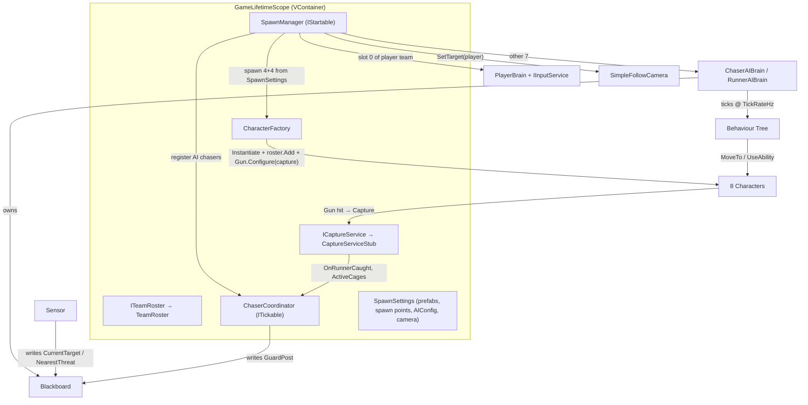
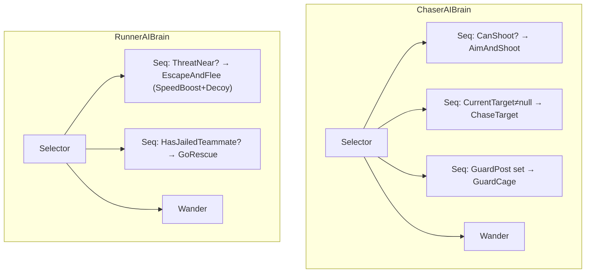

# NPC AI System — Behaviour Tree, Perception, Abilities, Match Spawning

- **Date:** 2026-09-23
- **Status:** Implemented & verified in Unity (EditMode 77/77; PlayMode 5/5; real-scene 1P+7NPC match playtest, 0 errors)
- **Branch:** `master` (with `feat/joystick-input` kept in sync)
- **Spec:** [NPC behaviour-tree design](../superpowers/specs/2026-09-21-npc-behaviour-tree-design.md)
- **Plan:** [NPC AI infrastructure](../superpowers/plans/2026-09-21-npc-ai-infrastructure.md)
- **Key commits:** `e0131af` (Phase 6 integration), `68a30f8` (movement balance)

## 1. What this system delivers

A full **NPC roster for the chase game**: chasers that hunt, shoot, capture and guard; runners that flee (using escape abilities) and try to rescue jailed teammates. One human player is spawned onto a random team; the other 7 characters are AI. It is built on the existing **Body / Brain separation** (see the foundation doc) and a hand-rolled **Behaviour Tree**, wired through **VContainer** DI.

**In scope:** BT core, role brains (chaser/runner), perception (distance + line-of-sight), abilities (Gun, SpeedBoost, Decoy), a capture stub, team roster, team-level chaser coordination, match spawning, and camera hand-off to the player.

**Out of scope (deferred, see §9):** a real JailSystem (cages/rescue), match end + win/lose UI, obstacle-carved navmesh, animation driven by movement.

## 2. Architecture

A character = **Body** (executes) + **Brain** (decides). Brains are attached at runtime, so prefabs stay pure Bodies. AI brains own a **Blackboard** and a **Sensor**, and tick a role-specific **Behaviour Tree** at a fixed low rate (`AIConfig.TickRateHz`); the NavMeshAgent/CharacterController still run every frame.

**Boot flow:** `GameLifetimeScope` builds the container → `SpawnManager.Start()` picks the player team by a coin flip, spawns both teams from their spawn points via `CharacterFactory`, promotes slot 0 of the player team to `PlayerBrain` and the rest to AI brains, registers AI chasers with `ChaserCoordinator`, and points `SimpleFollowCamera` at the player.

## 3. Behaviour Trees (spec §8)

Stateless re-tick each decision. `Selector` returns the first non-`Failure` child; `Sequence` returns the first non-`Success` child.

- **CanShoot:** target within `ShootRange` (planar) **and** ability 0 (Gun) ready. **AimAndShoot:** `UseAbility(0, dirToTarget)`.
- **GuardCage:** move to the `GuardPost` the coordinator assigned (holds a cage so runners can't rescue). Active hunting outranks guarding.
- **EscapeAndFlee:** fire ability 0 (SpeedBoost) and 1 (Decoy) if ready, then `MoveTo` a point directly away from the threat.
- **GoRescue:** move toward the nearest jailed teammate (contact-rescue lands with the real JailSystem later — currently approach-only).
- **Wander:** keep heading to a random reachable NavMesh point, picking a new one on arrival.

## 4. Assemblies

| Assembly (asmdef) | Path | References |
|---|---|---|
| `ChaseGame` | `Assets/Scripts/ChaseGame.asmdef` | `VContainer`, `Unity.InputSystem`, `DOTween.Modules` |
| `ChaseGame.Tests.EditMode` | `Assets/Tests/EditMode/…asmdef` | `ChaseGame`, TestRunner, `VContainer`, `Unity.InputSystem`, `nunit.framework.dll` |
| `ChaseGame.Tests.PlayMode` | `Assets/Tests/PlayMode/…asmdef` | `ChaseGame`, TestRunner, `nunit` |

All game sub-namespaces (`Characters`, `Input`, `Brains`, `Infrastructure`, `AI`, `AI.BehaviourTree`, `Abilities`, `Match`) live in the single `ChaseGame` assembly — they are namespaces, not separate assemblies.

## 5. Code map

### AI · Behaviour Tree core (`Assets/Scripts/AI/BehaviourTree/`)
| File | Responsibility | Key API |
|---|---|---|
| `NodeStatus.cs` | Tick result | `enum { Success, Failure, Running }` |
| `Node.cs` | Node base | `abstract NodeStatus Tick(Blackboard)` |
| `Selector.cs` | OR composite | first child not `Failure` |
| `Sequence.cs` | AND composite | first child not `Success` |
| `ConditionNode.cs` | Leaf predicate | `ConditionNode(Func<Blackboard,bool>)` |
| `ActionNode.cs` | Leaf action | `ActionNode(Func<Blackboard,NodeStatus>)` |
| `Blackboard.cs` | Shared data bag | `Self, Roster, Config, CurrentTarget, NearestThreat, Destination, GuardPost` |

### AI (`Assets/Scripts/AI/`)
| File | Responsibility | Key API |
|---|---|---|
| `AIConfig.cs` | Tunables (SO) | `VisionRadius 12, ShootRange 8, ThreatRadius 6, RescueThreatRadius 5, WanderRadius 6, TickRateHz 8` |
| `AIBrain.cs` | AI host base | `Initialize(Character, ITeamRoster, AIConfig)`; `Blackboard`; `TickForTests()`; `protected static Wander/TryRandomPoint`; ticks tree at `TickRateHz` |
| `ChaserAIBrain.cs` | Chaser BT | shoot → chase → guard → wander |
| `RunnerAIBrain.cs` | Runner BT | flee (SpeedBoost+Decoy) → rescue → wander |
| `Sensor.cs` | Perception | `static CandidatesFor(Team, ITeamRoster)`, `static NearestVisible(from, candidates, radius, hasLoS)`, `Sense(Blackboard)`; chasers also see active `DecoyLure`s |
| `ChaserCoordinator.cs` | Guard assignment (`ITickable`) | `Register(Blackboard)`; `Tick()`; `static Assign(chasers, cages)` = nearest free chaser per cage → `GuardPost` |
| `DecoyLure.cs` | Lure marker | `static List<DecoyLure> Active`; self-registers, auto-destroys after lifetime |

### Abilities (`Assets/Scripts/Abilities/`)
| File | Responsibility | Key API |
|---|---|---|
| `IAbility.cs` | Ability seam | `bool IsReady; void Use(Character, Vector3 aim)` |
| `CooldownTimer.cs` | Pure cooldown | `IsReady(now)`, `Trigger(now)` |
| `CharacterAbilities.cs` | Ordered ability set | `GetComponents<IAbility>()`; `IsReady(int)`, `UseAbility(int, Vector3)` by index |
| `Gun.cs` | Chaser hitscan (idx 0) | `range 8, cooldown 1, eyeHeight 0.6`; `Configure(ICaptureService)`; `static IsCapturable(Character)`; origin offset past self |
| `SpeedBoost.cs` | Runner ability (idx 0) | `multiplier 1.6, duration 3, cooldown 6` → `CharacterMovement.SetSpeedMultiplier` |
| `Decoy.cs` | Runner ability (idx 1) | `cooldown 8, lifetime 4, distance 5`; drops a `DecoyLure` opposite the flee dir |

> **Ability index contract:** chaser `[Gun]` → index 0 = Gun. Runner `[SpeedBoost, Decoy]` → 0 = SpeedBoost, 1 = Decoy. Order is the component order on the prefab (verified via `GetComponents<IAbility>`).

### Characters (`Assets/Scripts/Characters/`)
| File | Responsibility | Key API |
|---|---|---|
| `Character.cs` | Body root / command API | `Move`, `MoveTo`, `Stop` (all no-op when Jailed), `UseAbility(int,Vector3)`, `IsAbilityReady(int)`; `CaptureState` setter `Stop()`s on Free→Jailed; test seams `SetTeamForTests/SetMovementForTests/SetAbilitiesForTests` |
| `CharacterMovement.cs` | Hybrid movement | agent computes path (`updatePosition/Rotation = false`), controller moves; `BaseSpeed` from `CharacterStats`; `SetSpeedMultiplier` (syncs `agent.speed`); `static DesiredToDirection`, `static ShouldStopAtDestination` |
| `ICharacterMovement.cs` | Movement seam | `SetMoveDirection`, `MoveTo`, `Stop` |
| `ICharacterAbilities.cs` | Abilities seam | `IsReady(int)`, `UseAbility(int, Vector3)` |

### Match (`Assets/Scripts/Match/`)
| File | Responsibility | Key API |
|---|---|---|
| `ITeamRoster.cs` / `TeamRoster.cs` | Team membership | `Chasers`, `Runners`, `PlayerCharacter`, `Add`, `GetFreeRunners()`, `GetJailedRunners()`, `AllRunnersJailed()` |
| `ICaptureService.cs` / `CaptureServiceStub.cs` | Capture (stub) | `Capture(Character)`, `event Action<Character> OnRunnerCaught`, `ActiveCages` |
| `CageStub.cs` | Cage placeholder | `Occupant`, `Position` |

### Infrastructure (`Assets/Scripts/Infrastructure/`)
| File | Responsibility | Key API |
|---|---|---|
| `GameLifetimeScope.cs` | Per-scene DI | registers input, `SpawnSettings` instance, `ITeamRoster`, `ICaptureService`, `CharacterFactory`, `ChaserCoordinator` (entry point, AsSelf), `SpawnManager` (entry point) |
| `SpawnManager.cs` | Match bootstrap (`IStartable`) | `static PickPlayerTeam(float roll)`; spawns both teams, 1 PlayerBrain + 7 AI, registers AI chasers, retargets camera |
| `CharacterFactory.cs` | Spawn helper | `Spawn(prefab, pos, rot)` → Instantiate + `roster.Add` + `Gun.Configure(capture)` |
| `SpawnSettings.cs` | Scene refs (`[Serializable]`) | chaser/runner prefab, chaser/runner spawn points, `AIConfig`, `SimpleFollowCamera` |
| `SimpleFollowCamera.cs` | Camera follow | `SetTarget(Transform)`; `LateUpdate` SmoothDamp + `LookAt` |

### Brains (`Assets/Scripts/Brains/`)
`CharacterBrain` (base, `Initialize(Character)`) · `PlayerBrain` (`Initialize(Character, IInputService)`, reads `MoveAxis` → `Character.Move`).

## 6. Unity assets & scene wiring

| Asset / object | Where | Setup |
|---|---|---|
| `AIConfig` | `Assets/Configs/AIConfig.asset` | shared AI tunables |
| `ChaserStats` | `Assets/Configs/ChaserStats.asset` | Move Speed = 5 |
| `RunnerStats` | `Assets/Configs/RunnerStats.asset` | Move Speed = 6 (balance: runners faster than chasers) |
| `ChaserCharacter` | `Assets/Prefabs/ChaserCharacter.prefab` | `CharacterController` + `NavMeshAgent` (r 0.35, h 1, stop 0.3) + `CharacterMovement` (ChaserStats) + `Character` (Chaser) + `Gun` + `CharacterAbilities` |
| `RunnerCharacter` | `Assets/Prefabs/RunnerCharacter.prefab` | same Body + `Character` (Runner) + `SpeedBoost` + `Decoy` + `CharacterAbilities` (RunnerStats, **no Gun**) |
| Scene `Game` | `Assets/Scenes/Game.unity` | `SpawnPoints` (4 `ChaserSpawn_*` + 4 `RunnerSpawn_*`, navmesh-snapped); `GameLifetimeScope` with `SpawnSettings` wired; `Main Camera` + `SimpleFollowCamera`; baked NavMesh (`Assets/NavMeshData/Game_Map_NavMesh.asset`) over the map ground |

## 7. Testing

**EditMode (`Assets/Tests/EditMode/`) — 77 tests.** BT leaves/Sequence/Selector/integration; `CharacterMovementMath` (ComputeVelocity, DesiredToDirection, ShouldStopAtDestination); command gating; `SpeedMultiplier`; `TeamRoster`; `SensorSelection`; `ChaserAIBrain` (chase/jailed/**guard branch**); `RunnerAIBrain`; `CooldownTimer`; `CaptureServiceStub`; `GunTargeting`; `CharacterFactory`; `ChaserCoordinator`; `SpawnManager.PickPlayerTeam`.

**PlayMode (`Assets/Tests/PlayMode/`) — 5 tests** (runtime-baked NavMesh): hybrid movement (walk+settle, stop), chaser hunt, chaser shoot+jail, runner flee.

**Real-scene playtest** (Game scene, 1P + 7 NPC): 8 characters (4+4), 1 PlayerBrain + 7 AI, camera on player; chasers autonomously hunt → shoot → jail all runners (`AllRunnersJailed`), then all guard cages; captures spread over time after the speed balance. 0 console errors.

> **MCP/test gotchas:** `run_tests` silently falls back to the last-good assembly on compile failure — always confirm with `read_console(types=["error"])`. PlayMode toggles `EditorSettings.asset` (revert before commit). An unfocused Editor freezes play-mode time — set `Application.runInBackground = true` at runtime to let an automated playtest advance.

## 8. How to extend

- **New AI behaviour:** add `ConditionNode`/`ActionNode` delegates in a brain's `BuildTree()`; read/write the `Blackboard`. The core node types never touch game state directly.
- **New ability:** implement `IAbility` as a MonoBehaviour on the prefab; its index = component order. Brains call `UseAbility(index, aim)`.
- **New role / character:** duplicate the prefab pattern (Body + role `Character` + `CharacterStats` + abilities), add spawn points, wire into `SpawnSettings`.
- **New coordination:** follow `ChaserCoordinator` — a plain `ITickable` that writes decisions into registered `Blackboard`s; keep the decision logic in a pure `static` method for EditMode tests.

## 9. Known follow-ups (deferred by design)

- **Real JailSystem:** capture is a stub (`CaptureServiceStub` + `CageStub`) — no physical cage, and rescue is approach-only. Runners' `GoRescue` reaches a jailed teammate but does not free them yet.
- **Match end + UI:** ✅ **Implemented** — countdown, win/lose conditions, HUD, and end screen (BẠN THẮNG/THUA + Chơi lại/Thoát). See [Match End + UI](2026-09-23-match-end-and-ui.md).
- **Movement balance ceiling:** on the open floor the Gun (range 8 + vision 12) is the real dominance driver, so speed-only tuning has a ceiling; deeper balance needs gun/vision changes or obstacle cover.
- **Obstacle carving:** the map navmesh is an open floor (no buildings carved), so there is no cover for runners to break line-of-sight.
- **Minor (from review):** `MoveTo()` lacks the `isOnNavMesh` guard `Stop()` has; per-tick perception allocations (new lists each `Sense`); vision measured from the raised eye (~0.3% short); an automated PlayMode test that boots the full DI scene (the 1P+7NPC match was verified by observed playtest, not an automated test).
