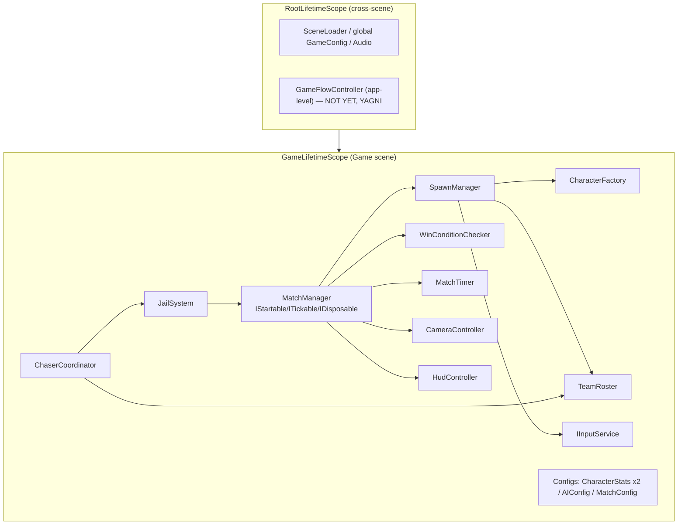
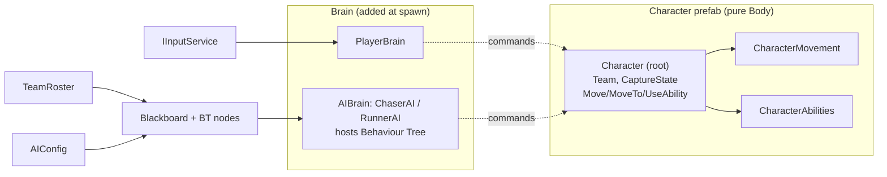
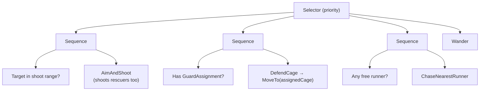
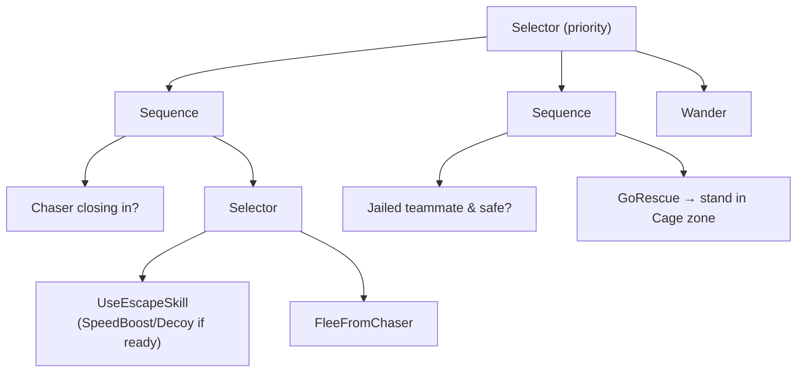
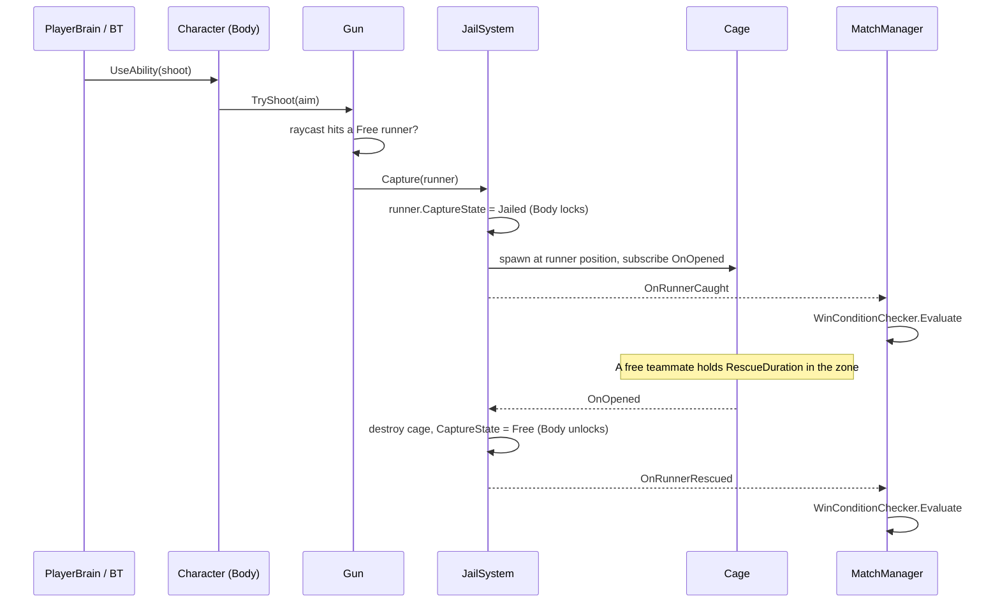

# Core Design Spec — Chase / Jailbreak Tag Game

- **Date:** 2026-09-09
- **Status:** Design approved, pending implementation plan
- **Scope:** Core system — characters, role assignment, spawning, AI, capture/jail/rescue, win/lose conditions

---

# CHAPTER A — Gameplay Design

## 1. Overview

A competitive **chase** game, purely single-player: **1 real player + 7 NPCs** per match.

- Each match has **8 characters**: 4 CHASERS + 4 RUNNERS.
- On entering a match the player is assigned a **random role (50/50)** — chaser or runner — and controls **one** character on that team. The other 7 are AI-controlled.
- **No networking / online multiplayer** — now or in the foreseeable future.

The gameplay resembles a **"cops and robbers / jailbreak"** style: chasers use guns to jail runners in cages; runners can rescue each other by freeing them from the cages.

### Role differences

Chasers and Runners are **fundamentally different** in model, animation, controls, and HUD. However, **within the same role, player and NPC are identical** — they differ only in the "brain" driving them (player input vs AI). This premise shapes the entire architecture.

## 2. Architecture principle: Body / Brain separation

A character = **Body** (the shell that *acts*) + **Brain** (the mind that *decides*). The Brain issues commands, the Body executes — never the reverse. The Body neither knows nor cares who controls it.

Consequences:
- The player is just "a chaser/runner whose Brain = player input".
- Swapping player ↔ NPC = swapping the Brain, without touching the Body.
- Editing one chaser ability = one place, applied to both player and NPC.

## 3. Prefabs

Make **2 prefabs, split by ROLE** (not by player/npc):

- `ChaserCharacter.prefab` — chaser model + Body components + chaser ability set. **No Brain.**
- `RunnerCharacter.prefab` — same for runner. **No Brain.**

Prefabs stay "pure body". The Brain is attached at spawn time.

## 4. Body components (on the prefab)

| Component | Responsibility |
|-----------|----------------|
| `Character` | Root coordinator. Holds `Team` (Chaser/Runner), references sub-components. Exposes the "API" the Brain calls: `Move(dir)`, `UseAbility(i)`, `GetCaught()`, `GetRescued()`… Decides nothing itself. |
| `CharacterMovement` | Actual movement (CharacterController or Rigidbody — decided at implementation), applies velocity, drives locomotion animation. |
| `CharacterAbilities` | Role-specific skills (see §6). |
| `CharacterStats` (ScriptableObject) | Tunables: speed, skill cooldowns… kept out of code so they are editable in the Editor. |

## 5. Brain components (attached at spawn — Method A)

```
CharacterBrain (base, MonoBehaviour, holds a Character reference)
├─ PlayerBrain            reads move / skill1 / skill2 buttons → Character.Move()/UseAbility()
└─ AIBrain (abstract)     NavMesh + behaviour tree
   ├─ ChaserAI            hunt/shoot free runners + guard threatened cages (see Chapter B)
   └─ RunnerAI            find nearest chaser → flee / use skills; go rescue jailed teammates
```

- `PlayerBrain` is a **single class** for both roles: it only reads generic input (move, skill 1, skill 2). Role-specific skill differences already live in `CharacterAbilities`.
- `AIBrain` is split into **`ChaserAI` / `RunnerAI`** because the two roles "think" very differently (hunt vs flee/rescue).
- **AI tuning via `AIConfig` (ScriptableObject):** vision, reaction speed, skill thresholds… Many AI agents share one config, editable in the Editor anytime while prefabs stay pure body.

**Brain attachment (Method A):**
```csharp
CharacterBrain brain = isPlayer
    ? go.AddComponent<PlayerBrain>()
    : go.AddComponent(aiTypeForRole);   // ChaserAI or RunnerAI
brain.Initialize(character /*, aiConfig if AI */);
```

## 6. Abilities per role

**CHASERS:**
- `Gun` — shoot (raycast or projectile — decided at implementation). Hitting a free runner triggers the capture flow.

**RUNNERS (2 active skills):**
- `SpeedBoost` — move faster for a short duration.
- `Decoy` — distract chasers (exact mechanic decided at implementation; e.g. spawn a lure / fake signal that pulls chaser AI away).

> **Rescuing a teammate is NOT an active (button) skill.** It is a *contact* action: a free runner standing inside a `Cage`'s zone long enough opens it. See Chapter B, Module 6.

## 7. Capture / Jail / Rescue

### Runner lifecycle (never permanently eliminated)

```
Free  ──(shot)──►  Jailed (in a cage)
  ▲                     │
  └──(teammate opens the cage)──┘
```

### Capture flow
1. A chaser shoots and hits a **Free** runner.
2. The runner gets a **slow/freeze effect** (short stun).
3. A **Cage spawns right on the spot** where the runner was hit, locking it in (**Jailed** state, cannot move).
4. `TeamRoster` marks it Jailed → `MatchManager` checks the win condition.

Confirmed default: **a single hit captures immediately** (no multi-hit).

### Rescue flow
1. A **Free** teammate approaches the Cage.
2. **Holds position for a few seconds** (progress bar).
3. The Cage opens → the runner returns to **Free** and plays on (its original Brain resumes).
4. `TeamRoster` updates.

### Player (runner) jailed experience
The camera stays on the player's cage, waiting for rescue. Rescued → play on. Whole team jailed → lose screen.

### Related components
- `Cage` — holds one jailed runner; has an open-progress; notifies the system when opened.
- `JailSystem` (may be folded into `MatchManager`) — orchestrates capture/rescue, updates the roster, runs the win check.

## 8. Win / Lose conditions

- Each match has a **countdown timer** (e.g. 3 minutes — tunable).
- **Chasers win:** all **4 runners jailed at the same time**. (Because of rescues the state oscillates — all must be jailed simultaneously to win.)
- **Runners win:** the timer hits 0 while **≥1 runner is Free**.
- The win check runs **on every capture or rescue event** (and on timeout).

## 9. Match start & spawn flow

**Orchestration components:**

| Component | Responsibility |
|-----------|----------------|
| `MatchManager` | Single entry point of a match. Random role, drives the spawner, holds the timer, judges win/lose. |
| `SpawnManager` | Only spawns: given (prefab, spawn-point list) → produces `Character`s. |
| `TeamRoster` | After spawn, holds the 4 chasers + 4 runners (with each runner's Free/Jailed state) + a reference to the player's character. AI queries it to find targets. |

**Spawn points:** two parent objects `ChaserSpawns` and `RunnerSpawns` in the scene, each with 4 children as start positions. `SpawnManager` reads these.

**Sequence on entering the Game scene (after Loading):**
```
MatchManager.Start()
 ├─ 1. playerTeam = Random 50/50 (Chaser | Runner)
 ├─ 2. SpawnManager.SpawnTeam(ChaserCharacter, chaserSpawns) → 4 chasers
 │     SpawnManager.SpawnTeam(RunnerCharacter, runnerSpawns) → 4 runners
 ├─ 3. Pick 1 random character in the playerTeam group as the player
 ├─ 4. Attach Brain (Method A): player one → PlayerBrain; other 7 → ChaserAI/RunnerAI + AIConfig
 ├─ 5. Register all into TeamRoster
 └─ 6. PlayerBrain init →
         • CameraController.Follow(playerCharacter)
         • HudController.Bind(playerCharacter, playerTeam)   ← pick the role's HUD
```

**AI finds targets via `TeamRoster`** (no per-frame `FindObjectsOfType`): chasers ask for "free runners"; runners ask for "chasers" and "cages needing rescue".

## 10. Editor setup dependencies

- **Bake a NavMesh** for the map so AI (`ChaserAI`/`RunnerAI`) can pathfind.
- Place the two spawn-point groups (`ChaserSpawns`, `RunnerSpawns`), ≥ 4 points each.
- Create ScriptableObject assets: `CharacterStats` (per role), `AIConfig`.
- A `Cage` prefab for the `Cage` component / `JailSystem` to instantiate on capture.

## 11. Test strategy

The Body/Brain split makes testing much easier.

- **EditMode (pure logic, no scene):**
  - Cooldown logic in `CharacterAbilities`.
  - `TeamRoster`: add/remove/flip Free↔Jailed, queries.
  - `MatchManager`/`WinConditionChecker`: correct win/lose from roster state (4 jailed → chasers win; timeout with ≥1 free → runners win).
- **PlayMode:**
  - Enter a match → exactly 8 characters, exactly **1** `PlayerBrain`, camera follows player.
  - Simulate a hit → runner becomes Jailed + a Cage appears.
  - Simulate a rescue → runner returns to Free.
  - Jail all 4 → chasers win; timeout with a free runner → runners win.
- **Debug perk from the split:** attach `AIBrain` to the player's own character to watch the AI play, or attach `PlayerBrain` to any character — handy for debugging both roles.

## 12. Deferred to implementation

- Rigidbody vs CharacterController for `CharacterMovement`.
- Gun as raycast vs projectile.
- Concrete `Decoy` mechanic (how it distracts chaser AI).
- Concrete durations: match timer, hit-stun, rescue hold time, skill cooldowns (into `CharacterStats`/`AIConfig`).
- Two separate HUD sets for chaser/runner.

---
---

# CHAPTER B — Technical Architecture

This chapter fixes how Chapter A is realized in code. Foundational decisions:

| Topic | Decision |
|-------|----------|
| DI container | **VContainer** |
| AI model | **Behaviour Tree** (hand-rolled, lightweight; NPBehave left open if tooling is later needed) |
| Layering | **Pragmatic MonoBehaviour** — logic in MonoBehaviours, VContainer handles wiring/dependencies. POCO exceptions: `WinConditionChecker`, `TeamRoster`, `MatchTimer` |
| Communication | **Direct DI + C# events** (no message bus) |
| DI scope | **One scope per scene** |

## Architecture overview diagram



## B0. DI layout (VContainer)

```
RootLifetimeScope            (lives across scenes — at Loading/bootstrap)
  ├─ SceneLoader, global GameConfig, Audio... (shared services)
  │  (app-level GameFlowController: NOT built — YAGNI, add when a menu flow exists)
  │
  └─ GameLifetimeScope       (in the Game scene) — registers:
       • MatchManager (IStartable/ITickable/IDisposable)
       • SpawnManager, CharacterFactory
       • TeamRoster, JailSystem, WinConditionChecker, MatchTimer
       • ChaserCoordinator
       • CameraController, HudController, IInputService
       • Config assets: CharacterStats (2 roles), AIConfig, MatchConfig
       • Scene/prefab refs via an installer MonoBehaviour (see B5)
```

## B1. Module map (8 blocks)

| # | Module | Main components |
|---|--------|-----------------|
| 1 | Bootstrap/DI | `RootLifetimeScope`, `GameLifetimeScope`, installer |
| 2 | Match | `MatchManager`, `TeamRoster`, `MatchTimer`, `WinConditionChecker` |
| 3 | Character (Body) | `Character`, `CharacterMovement`, `CharacterAbilities`, `CharacterStats` (SO) |
| 4 | Brain | `PlayerBrain`; `AIBrain` (BT host) + BT nodes + `Blackboard`; `ChaserCoordinator` |
| 5 | Spawning | `SpawnManager`, `CharacterFactory` |
| 6 | Capture | `Gun`, `Cage`, `JailSystem` |
| 7 | Presentation | `CameraController`, `HudController` (2 HUD variants) |
| 8 | Input | `IInputService` |

## Body / Brain composition diagram



## B2. Brain + Behaviour Tree module

**BT infrastructure (hand-rolled):**
```
NodeStatus { Success, Failure, Running }
Node (abstract) → Tick() : NodeStatus
├─ Selector (fallback — used for PRIORITY)
├─ Sequence
├─ ConditionNode
└─ ActionNode
Blackboard: Character, TeamRoster, NavMeshAgent, CurrentTarget,
            NearestThreat, NearestCage, GuardAssignment, AIConfig
```

**`AIBrain`** (MonoBehaviour host): `Initialize(character, roster, aiConfig)` builds the Blackboard + the role's tree; a sensor updates the Blackboard; **ticks the BT at ~5–10 Hz**, while the NavMeshAgent runs every frame.

**`ChaserAI` tree** (includes cage guarding):



**`RunnerAI` tree:**



**Nodes shared by both roles:** `MoveTo`, `DetectNearest`, `IsInRange`, `Wander`, `UseAbility`. Only the *tree shape* differs.
**Boundary:** action nodes only call the Body API (`Character.Move/MoveTo/UseAbility`), never touch NavMeshAgent/animation directly (except the sensor reading state for perception).

**`ChaserCoordinator`** — team-level brain for chasers (DI-registered, ticked ~5–10 Hz):
```
Each tick:
  1. "threatened" cages = a free runner within RescueThreatRadius
  2. assign the FREE & NEAREST chaser to guard each (1 guard/cage)
  3. write blackboard.GuardAssignment per ChaserAI (null → go hunt)
```
Only guard assignment is centralized; hunting stays per-agent. `SpawnManager` registers each `ChaserAI` with the coordinator.

**`PlayerBrain`** (single class, no BT): `Initialize(character, inputService)`; `Update()` reads input → `Character.Move/UseAbility`. Camera + HUD are wired by `MatchManager` after spawn, not by PlayerBrain.

## B3. Match module

**`MatchManager` : IStartable, ITickable, IDisposable**
```
Start(): random role → SpawnManager.SpawnMatch → wire Camera/HUD to player
         → subscribe JailSystem.OnRunnerCaught/OnRunnerRescued → state=Playing, timer.Reset
Tick():  if Playing: timer.Tick; time up → OnTimeUp
Dispose(): unsubscribe
Lifecycle: Preparing → Playing → Ended (freeze brains, fire OnMatchEnded(result))
```

**`TeamRoster`** (plain C#, DI singleton): Chasers/Runners lists + `PlayerCharacter`; the **source of truth for Free/Jailed lives on `Character.CaptureState`**, the roster only reads & filters (`GetFreeRunners`, `GetJailedRunners`, `AllRunnersJailed`, `GetActiveCages` delegated to JailSystem). Passive, raises no events.

**`WinConditionChecker`** (POCO, unit-tested):
```
Evaluate(roster, timeUp):
  AllRunnersJailed → ChasersWin
  else timeUp      → RunnersWin
  else             → None
```
Called after every capture/rescue and on timeout. All jailed → chasers win immediately (no wait for timer).

**`MatchTimer`** (POCO): `Tick(deltaTime)`, `IsUp` flag; driven by `MatchManager.Tick()`.
**`MatchConfig` (SO):** `Duration`, start "ready" countdown.

## Capture & rescue sequence



## B4. Capture module

**Split of duties:** `Gun` = fire + hit detection · `JailSystem` = consequence/source of truth · `Cage` = dumb cage (rescue zone + progress, only fires events).

```
Gun.TryShoot(aim): raycast hits Free runner → JailSystem.Capture(runner)

JailSystem.Capture(runner):  guard Free →
   CaptureState=Jailed (Body locks) · spawn Cage on the spot · subscribe cage.OnOpened
   · raise OnRunnerCaught → MatchManager → win-check
JailSystem.Rescue(runner):   guard Jailed →
   destroy Cage · CaptureState=Free (Body unlocks) · raise OnRunnerRescued

Cage: trigger zone; a Free runner holding RescueDuration → fires OnOpened (JailSystem does Rescue)
```
**Lock while Jailed:** `Character.Move()` no-ops → no Brain needs to know. (Optionally disable the brain component to save CPU.)

## B5. Spawning + Factory/DI module

**`CharacterFactory`** wraps `IObjectResolver.Instantiate(prefab,pos,rot)` → the prefab gets injected.
**Installer MonoBehaviour** (or `GameLifetimeScope`) serializes & registers scene refs: `chaserPrefab/runnerPrefab/cagePrefab`, `Transform[] chaserSpawns/runnerSpawns`, config assets → `SpawnManager` receives them via injection.
```
SpawnManager.SpawnMatch(playerTeam):
  playerIdx = Random 0..3 within playerTeam
  per team, per spawn point: char = factory.Create(prefab, point)
    player one → PlayerBrain.Initialize(char, input)
    others     → AIBrain(Chaser/Runner).Initialize(char, roster, aiConfig)
                 if ChaserAI → coordinator.Register(ai)
    roster.Add(char)
  roster.PlayerCharacter = the chosen one
```

## B6. Character Body module

**`Character`** (root): `Team`, `CaptureState`; Brain API: `Move(dir)` (no-op when Jailed), `MoveTo(pos)`, `Look(dir)`, `UseAbility(id)`.
**`CharacterMovement`**: two modes `MoveDirection(dir)` (player) / `MoveTo(dest)` (AI-NavMeshAgent); animation from real speed. (NavMeshAgent vs CharacterController left open.)
**`CharacterAbilities`**: `UseAbility(id)` → sub-ability + cooldown from Stats. Chaser=[Gun]; Runner=[SpeedBoost, Decoy]. **Rescue is contact via Cage, not an ability.**
**`CharacterStats` (SO/role):** moveSpeed, skill params/durations, Gun cooldown...

## B7. Presentation module

**`CameraController.Follow(playerCharacter)`** (perspective TBD); a jailed player still follows their own character.
**`HudController.Bind(player, team)`** → activates the right HUD variant (chaser: crosshair/gun cooldown/free-runner count/timer; runner: skill cooldowns/rescue bar/jailed-teammate count/timer); listens to `OnMatchEnded` → result screen.

## B8. Input module

**`IInputService`** (DI): `MoveAxis`, `AimDir`, `Skill1/2Pressed`, `FirePressed`. Only `PlayerBrain` uses it → easy to swap backends & test with fake input.

## B9. Additional setup dependencies (continuing §10)

- Install the **VContainer** package.
- Create an installer MonoBehaviour in the Game scene holding prefab/spawn-point/config refs.
- Additional config assets: `AIConfig` (RescueThreatRadius, tick rate, vision...), `MatchConfig`.
